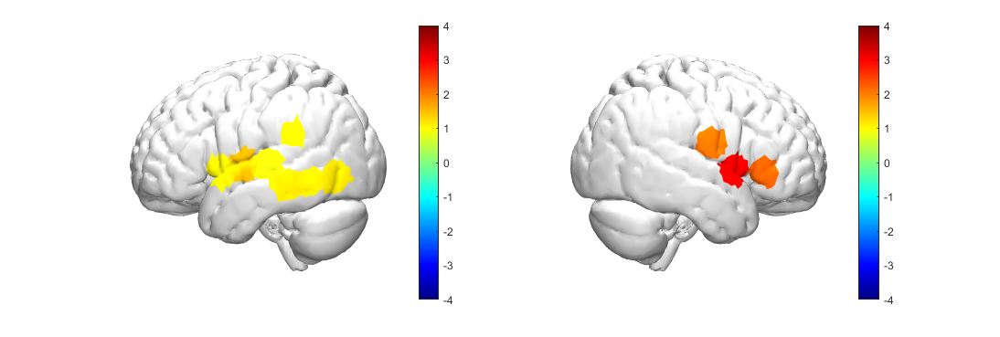

# fNIRS Data Processing Using NIRS Toolbox

This repository contains different MATLAB scripts for fNIRS data processing pipelines. 

**NOTE**: You will need to first install **NIRS toolbox** (see [Installation](#installation) for details) in MATLAB in order to run these pipelines.

<p align="left">
  
  
  
</p>

## Table of Contents
- [Features](#features)
- [Installation](#installation)
- [Usage](#usage)
- [NIRS Data Quality Control](#nirs-data-quality-control)
- [Analysis Workflow](#analysis-workflow)
- [Group Level Formula](#group-level-formula)
- [FIR Analysis](#finite-impulse-response-fir-analysis)
- [Common Q&A](#common-qa)
- [More Questions?](#more-questions)

## Features
✔️ First-level GLM analysis  
✔️ First-level FIR analysis  
✔️ Second-level (group-level) analysis  
✔️ GPU acceleration for first-level analysis  

## Installation

To run the full pipeline, ensure you have the following prerequisites:

1. Download the **NIRS Toolbox** from: [NIRS Toolbox GitHub](https://github.com/huppertt/nirs-toolbox.git)  
   - Option 1: Clone the repository using Git:  
     ```sh
     git clone https://github.com/huppertt/nirs-toolbox.git
     ```
   - Option 2: Download the repository manually by clicking the **Download** button on GitHub.

2. Add the **NIRS Toolbox** folder to the MATLAB path:  
   - For a **permanent** path addition, use **Set Path** in MATLAB.  
   - For a **temporary** path addition, right-click the folder in MATLAB and select **Add Selected Folders and Subfolders**.

## Usage

The following section provides a high-level overview of the analysis process.  
For detailed examples, refer to:  
- The example pipeline in this repository.  
- The **demo** folder in the **NIRS Toolbox**.

## NIRS Data Quality Control
1. Signal-to-noise-ratio (SNR)
2. Oxy-deoxy anti (cross) correlation check
   - Because deoxy is usually slower than oxy (a few seconds), thus a cross correlation with lags might be used
   - Oxy response is usually 3-4 times larger in scale than de-oxy response 
3. Cardiac response in the signal (maybe able to use scalp coupling index to check)
4. Motion artifact check
   - Wavelet
   - PCA
   - Spline interpolation 
   - TDDR 

## Analysis Workflow

The analysis of fNIRS data follows these steps:
> **NOTE:** If you want to run motion corrections like TDDR, please run it before you downsample the data.

1. **Subject-Level Analysis (First Level)**  
   - Perform individual-level analysis using:  
     - General Linear Model (GLM)  
     - Finite Impulse Response (FIR) analysis  

2. **Group-Level Analysis (Second Level)**  
   - Conduct group-level analysis using a **Linear Mixed Effects Model**  

3. **Statistical Tests**  
   - Within group-level analysis, statistical significance can be assessed using:  
     - **F-test**  
     - **t-test** with proper contrasts  

4. **Visualization**  
   - Finally, results can be plotted for interpretation and reporting (see the code in ResultsPlloting folder).  
   


## Group Level Formula  

The group-level analysis uses **Wilkinson Notation** to represent equations in a compact form.  

🔗 **[Learn more about Wilkinson Notation](https://www.mathworks.com/help/stats/wilkinson-notation.html)**  

This notation is commonly used in statistical modeling to define relationships between variables concisely.

## Finite Impulse Response (FIR) Analysis

The FIR analysis is used for estimation of the hemodynamic response based on impulse stimuli. The idea is to deconvolve the stimulus response out from the real data based on the stimulus marks.

The FIR analysis can be done using the nirs toolbox by setting the basis to be `nirs.design.basis.FIR()` and then applying the regression. It is recommended to resample the data to **2 Hz or 1 Hz** to increase calculation speed.

The parameters in the FIR basis: 
```
basis.binwidth=1; % each bin is 1 sample wide
basis.nbins=24;  % 2hz x 12s = 24 bins
basis.isIRF=0; % estimate impulse response (stim duration to be impulse) model
           =1; % estimate full response (consider stim duration) model
```

After the regression step, the HRF object can be extracted with:

```matlab
HRF = SubjStats.HRF
HRF.gui
```

At the subject level, statistical tests can be performed using ttest, for example:

```matlab
SubjStats.ttest('condA[4-12s]')
SubjStats.ttest('condA[4-12s] - condB[4-12s]')
SubjStats.ttest('condA[4-12s] - condA[0-4s]')
```
## **Common Q&A**  

### **1. What is the difference between correlation and partial correlation?**  
**A:** Partial correlation measures the direct association between two variables while controlling for the influence of one or more additional variables. This helps isolate the unique relationship between the two variables by removing confounding effects.  

### **2. Should I collect fNIRS and EEG data simultaneously?**  
**A:** Only if it is necessary to capture information at the same time. Otherwise, fNIRS and EEG can be conducted separately to optimize resources and reduce potential interference.  

### **3. What should I do if I get an out-of-memory (OOM) error during group-level analysis?**  
**A:** You can use the `nirs.module.GroupAverage()` function instead of LME. However, this approach does not model random effects.  

### **4. Which condition should I examine when using derivatives with my HRF model?**  
**A:** Always focus on the effect of the first term. For example, if you have **EASY** and **HARD** conditions, examine **EASY:01** and **HARD:01**.  

### **5. What is the optimal downsampling rate for data analysis?**  
**A:** Since fNIRS data primarily contain information within the **0-1 Hz** range, a **2 Hz** downsampling rate is recommended. However, for faster first-level processing, you can use **1 Hz**, especially in **hyperscanning** studies.  

### **6. When should I perform motion correction?**  
**A:** If you choose to apply motion correction, it should be done **before downsampling** to preserve signal integrity.  

### **7. Should I run a regular GLM after motion correction (e.g., TDDR)?**  
**A:** No, after motion correction, you should always use algorithms like **AR-IRLS** instead of a regular GLM.  

### **8. How do I determine what analyses I can perform with my data or results?**  
**A:** You can use the `methods()` function. For example:  

```matlab
methods(SubjStats)
methods(Data)
```

## More Questions?

For any inquiries, please contact:  
**Frank Hu** – [xiaosuhu@umich.edu](mailto:xiaosuhu@umich.edu)